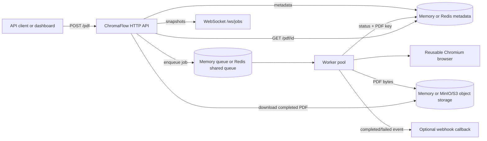
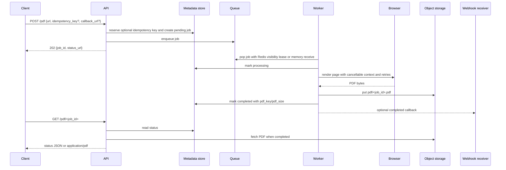
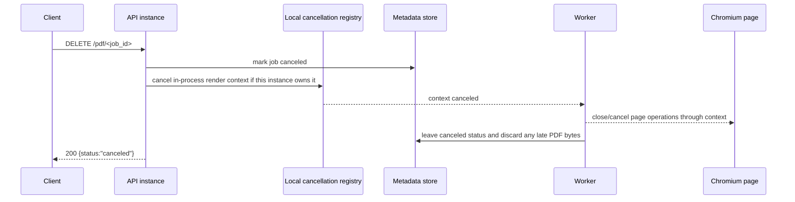

# ChromaFlow

ChromaFlow is a Go HTTP service for turning web pages into PDF files with headless Chromium. Clients submit URL jobs through the API or the built-in dashboard, workers render each page with [go-rod](https://github.com/go-rod/rod), and the completed PDF is served from the job endpoint.

ChromaFlow can run as a single-node in-memory service or as a horizontally scalable service using Redis for shared queue/result metadata and S3-compatible object storage such as MinIO for generated PDFs.

## Features

- JSON API for URL-to-PDF job submission.
- Browser dashboard at `/` for submitting jobs and watching state changes.
- WebSocket job snapshot stream at `/ws/jobs`.
- Configurable in-memory or Redis-backed queue/result metadata backend with explicit full-queue responses.
- Configurable in-memory or S3-compatible/MinIO PDF object storage.
- Job cancellation and idempotency keys via request JSON or the `Idempotency-Key` header.
- Reused Chromium browser instance to avoid launching a browser for every job.
- Configurable worker count, queue size, and render timeout.
- URL validation that accepts only absolute `http` and `https` URLs.
- Headless Chromium rendering through go-rod.
- Health, readiness, version, OpenAPI, and Prometheus metrics endpoints for operations.
- Structured JSON logs written to stdout with job, worker, host, duration, and PDF-size fields.
- Docker Compose observability stack with Prometheus, Grafana, Loki, and Promtail.
- Kubernetes manifests for ChromaFlow and the monitoring stack.
- Container image with Chromium installed.
- Linux and Windows binary release workflow.

## Architecture

```text
client/dashboard -> HTTP API -> memory/Redis queue -> worker pool -> reused Chromium -> memory/Redis metadata
       ^                              |                                |
       |                              v                                v
       +---------------------- WebSocket snapshots <------------- status/PDF endpoint -> memory/MinIO PDFs
```
### Integration architecture



### Job workflow



### Cancellation flow




Important directories:

| Path | Purpose |
| --- | --- |
| `cmd/server/main.go` | Service wiring, routes, workers, graceful shutdown, version injection. |
| `internal/api/handler.go` | Dashboard, PDF job API, health/readiness handlers, websocket route. |
| `internal/config/config.go` | Environment variable configuration. |
| `internal/observability/` | Prometheus-format metrics and structured JSON logging setup. |
| `internal/pdf/generator.go` | Chromium launch/connect and PDF rendering. |
| `internal/queue/` | In-memory and Redis queue backends plus job types. |
| `internal/realtime/` | Minimal stdlib websocket hub for job snapshots. |
| `internal/storage/` | In-memory and Redis job metadata storage and snapshot listing. |
| `internal/blob/` | In-memory and S3-compatible PDF object storage. |
| `internal/worker/` | Worker pool and job processing. |
| `observability/` | Prometheus, Loki, Promtail, and Grafana provisioning used by Docker Compose. |
| `k8s/` | Plain Kubernetes YAML for ChromaFlow, services, ingress, Prometheus, Grafana, Loki, and Promtail. |

## API

### Submit a PDF job

```sh
curl -i -X POST http://localhost:8080/pdf \
  -H 'Content-Type: application/json' \
  -H 'Idempotency-Key: tenant-a-example-report' \
  -d '{"url":"https://example.com"}'
```

Successful submissions return `202 Accepted`:

```json
{
  "job_id": "...",
  "status_url": "/pdf/..."
}
```

Submitting the same idempotency key again returns the original job ID and sets `idempotent: true`. You can also send `idempotency_key` in the JSON body.

If `REQUIRE_IDEMPOTENCY_KEY=true`, requests without an `Idempotency-Key` header or `idempotency_key` field are rejected. By default idempotency keys are optional.

Add `callback_url` to a request, or set `WEBHOOK_URL`, to receive a `POST` when the job completes or fails.

Cancel a queued or in-flight job with either endpoint:

```sh
curl -X DELETE http://localhost:8080/pdf/<job_id>
curl -X POST http://localhost:8080/pdf/<job_id>/cancel
```

Validation and capacity errors return machine-readable JSON such as `{"error":"invalid_url","message":"URL must include a host","request_id":"..."}`. Common statuses are:

- `400 Bad Request` for invalid JSON, empty URLs, relative URLs, invalid callback URLs, missing required idempotency keys, or schemes other than `http`/`https`.
- `503 Service Unavailable` when the configured queue backend is full.

### Fetch job status or PDF

```sh
curl -OJ http://localhost:8080/pdf/<job_id>
```

If the job is pending, processing, or failed, the endpoint returns JSON:

```json
{
  "job_id": "...",
  "url": "https://example.com",
  "status": "processing",
  "error": ""
}
```

When the job completes, the same endpoint returns `application/pdf` bytes with an attachment filename.

### Dashboard and realtime updates

Open `http://localhost:8080/` to submit jobs and watch the queue update live. Connect to `ws://localhost:8080/ws/jobs` to receive full queue snapshots whenever a job changes state.

Example websocket message:

```json
{
  "type": "jobs",
  "jobs": [
    {
      "id": "...",
      "url": "https://example.com",
      "status": "completed",
      "created_at": "2026-05-01T09:18:54Z",
      "updated_at": "2026-05-01T09:18:56Z"
    }
  ]
}
```

### Operations endpoints

| Endpoint | Purpose |
| --- | --- |
| `GET /healthz` | Liveness probe. Returns `{"status":"ok"}`. |
| `GET /readyz` | Readiness probe. Returns `{"status":"ready"}`. |
| `GET /version` | Returns the build version injected by CI/CD. |
| `GET /metrics` | Prometheus text exposition metrics for HTTP requests, queue depth, worker count, job statuses, render durations, and PDF bytes. |
| `GET /openapi.yaml` | OpenAPI 3.0 YAML document for the public HTTP API. |

Prometheus alert rules for high queue depth, high render error rate, p95 render latency, worker starvation, and storage byte growth are included under `observability/rules/` and in the Kubernetes Prometheus config.

Metrics include counters and gauges such as `chromaflow_jobs_submitted_total`, `chromaflow_jobs_rejected_total`, `chromaflow_queue_depth`, `chromaflow_active_workers`, `chromaflow_jobs_in_storage`, `chromaflow_pdf_render_duration_seconds`, `chromaflow_pdf_bytes_total`, and HTTP request metrics.

ChromaFlow logs are structured JSON on stdout. The log records include stable fields such as `service`, `version`, `level`, `msg`, `request_id`, `job_id`, `worker_id`, `url_host`, `duration`, `pdf_bytes`, and `error` where applicable. Incoming `X-Request-ID` headers are propagated; otherwise ChromaFlow generates one and returns it on responses.

## Configuration

Environment variables:

| Name | Default | Description |
| --- | --- | --- |
| `PORT` | `8080` | HTTP server port. |
| `NUM_WORKERS` | `0` | Number of workers. `0` auto-detects as `runtime.NumCPU() * 2`. |
| `QUEUE_SIZE` | `100` | Queue capacity for memory mode and soft cap for Redis mode. |
| `QUEUE_BACKEND` | `memory` | Queue backend: `memory` or `redis`. |
| `LOG_LEVEL` | `info` | Structured log level: `debug`, `info`, `warn`, or `error`. |
| `STORAGE_BACKEND` | `memory` | Job metadata backend: `memory` or `redis`. Defaults independently to memory. |
| `REDIS_URL` | `redis://localhost:6379/0` | Redis URL for shared queue/result metadata. |
| `REDIS_KEY_PREFIX` | `chromaflow` | Redis key namespace. |
| `REDIS_VISIBILITY_TIMEOUT` | `300` | Seconds before an unacked Redis job lease is considered abandoned and eligible for requeue. Keep above `PAGE_TIMEOUT` plus retry budget. |
| `BLOB_BACKEND` | `memory` | PDF blob backend: `memory`, `s3`, or `minio`. |
| `S3_ENDPOINT` | `localhost:9000` | S3-compatible endpoint for MinIO/object storage. |
| `S3_ACCESS_KEY_ID` | `minioadmin` | S3 access key. |
| `S3_SECRET_ACCESS_KEY` | `minioadmin` | S3 secret key. |
| `S3_BUCKET` | `chromaflow-pdfs` | Bucket for generated PDF objects. |
| `S3_REGION` | `us-east-1` | S3 signing region. |
| `S3_USE_SSL` | `false` | Use HTTPS for object storage. |
| `REQUIRE_IDEMPOTENCY_KEY` | `false` | Require clients to send an idempotency key. Optional by default. |
| `WEBHOOK_URL` | empty | Default callback URL for completed/failed jobs when a request does not provide `callback_url`. |
| `WEBHOOK_TIMEOUT` | `10` | Webhook HTTP timeout in seconds. |
| `RENDER_MAX_RETRIES` | `1` | Number of retries after the first render attempt for transient browser/page failures. |
| `RENDER_RETRY_BACKOFF_MS` | `500` | Delay between render retries in milliseconds. |
| `PAGE_TIMEOUT` | `30` | Per-page render timeout in seconds. |
| `RESULT_TTL` | `3600` | Reserved for future result expiration. |
| `CHROME_WS_URL` | empty | Existing Chrome DevTools websocket URL. Empty launches local Chromium. |
| `CHROME_BIN` | auto-detected | Chromium/Chrome executable path when launching a local browser. |

## Run locally as a binary

Requirements:

- Go 1.24+
- Chromium or Chrome installed on the host, or a `CHROME_WS_URL` pointing to a running browser

```sh
GOCACHE=/tmp/chromaflow-gocache go test ./...
GOCACHE=/tmp/chromaflow-gocache go build -trimpath -o dist/chromaflow ./cmd/server
PORT=8080 NUM_WORKERS=2 PAGE_TIMEOUT=30 ./dist/chromaflow
```

On Windows, build and run the `.exe` variant:

```powershell
$env:GOOS="windows"; $env:GOARCH="amd64"; $env:CGO_ENABLED="0"
go build -trimpath -o dist/chromaflow.exe ./cmd/server
$env:PORT="8080"; .\dist\chromaflow.exe
```

Make sure Chrome or Chromium is installed and set `CHROME_BIN` if it is not discoverable from `PATH`.

### Local Chrome/Chromium setup

ChromaFlow uses the Chrome DevTools Protocol through go-rod. You can either let ChromaFlow launch a local browser or point `CHROME_WS_URL` at an already-running Chrome/Chromium instance.

**Linux**

- Debian/Ubuntu containers and hosts usually work with `chromium` or `chromium-browser` packages.
- If the binary is not on `PATH`, set `CHROME_BIN=/usr/bin/chromium` or `CHROME_BIN=/usr/bin/chromium-browser`.
- Containerized runs use `NoSandbox(true)` for compatibility; hardened production deployments should review Chromium sandbox requirements for their runtime.

**macOS**

- Install Google Chrome normally or with Homebrew: `brew install --cask google-chrome`.
- If auto-detection fails, set `CHROME_BIN="/Applications/Google Chrome.app/Contents/MacOS/Google Chrome"`.
- For an external browser, launch Chrome with remote debugging, for example: `"/Applications/Google Chrome.app/Contents/MacOS/Google Chrome" --headless=new --remote-debugging-port=9222`, then set `CHROME_WS_URL` to the websocket URL exposed by Chrome.

**Windows**

- Install Google Chrome or Microsoft Edge.
- Set `CHROME_BIN` to a full executable path such as `C:\Program Files\Google\Chrome\Application\chrome.exe` if auto-detection fails.
- For a separately managed browser, launch `chrome.exe --headless=new --remote-debugging-port=9222` and set `CHROME_WS_URL` to the DevTools websocket endpoint.

`PAGE_TIMEOUT` applies to each render attempt, and cancellation requests cancel the in-process render context for jobs owned by the current instance.


## Run with Docker

```sh
docker build -t chromaflow .
docker run --rm -p 8080:8080 \
  -e NUM_WORKERS=4 \
  -e QUEUE_SIZE=100 \
  -e PAGE_TIMEOUT=30 \
  chromaflow
```

Or use Compose, which starts ChromaFlow with Redis and MinIO by default, plus Prometheus, Grafana, Loki, and Promtail:

```sh
docker compose up --build
```

Local service URLs:

| URL | Service |
| --- | --- |
| `http://localhost:8080` | ChromaFlow dashboard/API. |
| `http://localhost:8080/metrics` | ChromaFlow metrics scraped by Prometheus. |
| `http://localhost:9090` | Prometheus. |
| `http://localhost:9001` | MinIO console (`minioadmin` / `minioadmin` locally). |
| `http://localhost:3000` | Grafana (`admin` / `admin` locally). The bundled dashboard uses Prometheus for metrics and Loki for logs. |
| `http://localhost:3100` | Loki API. |

Released images are published by GitHub Actions to GitHub Container Registry as:

```sh
docker pull ghcr.io/<owner>/<repo>:<tag>
```

For this repository, replace `<owner>/<repo>` with the GitHub repository path after it is published.

## Kubernetes

Plain manifests live in `k8s/` and deploy ChromaFlow, example Redis/MinIO dependencies, Prometheus, Grafana, Loki, and Promtail into a `chromaflow` namespace. Replace the image placeholder in `k8s/chromaflow.yaml` before deploying:

```sh
kubectl apply -f k8s/namespace.yaml
kubectl apply -f k8s/
```

Ingress examples use `chromaflow.local` for the app and `grafana.chromaflow.local` for Grafana with an `nginx` ingress class. Production clusters should add TLS, persistent volumes for Prometheus/Loki/Grafana, real secrets, resource tuning, and environment-specific ingress annotations.

## Load testing

A small Go load-test helper submits concurrent jobs against a running ChromaFlow instance:

```sh
make load-test BASE_URL=http://127.0.0.1:8080 REQUESTS=50 CONCURRENCY=8 TARGET_URL=https://example.com
```

Use it with `docker compose up --build` to exercise the Redis/MinIO path locally.

## Future dependencies and auth

Redis and MinIO support are now available for horizontal scaling. Optional RabbitMQ or Kafka for asynchronous job events, webhooks, and token-based authentication are still future work before the API is exposed outside trusted networks. When these are added, update the OpenAPI security schemes, Kubernetes secrets/config maps, Docker Compose services, and operational docs together.

## CI/CD and releases

This repository includes two GitHub Actions workflows:

- **CI** (`.github/workflows/ci.yml`) runs formatting, `go vet`, `go test -race ./...`, builds the load-test tool, builds a Linux binary, and builds a Docker image on pushes and pull requests.
- **Release** (`.github/workflows/release.yml`) runs on tags matching `v*.*.*` and publishes:
  - Linux `amd64` and `arm64` binaries.
  - Windows `amd64` and `arm64` binaries.
  - SHA-256 checksum files.
  - Multi-architecture container images to `ghcr.io/${{ github.repository }}`.
  - A GitHub Release with generated release notes.

Release procedure:

```sh
git tag v0.1.0
git push origin v0.1.0
```

## Production notes

- Treat submitted URLs as untrusted input. ChromaFlow currently restricts schemes to `http` and `https`, but production deployments should also add SSRF defenses for private networks, redirects, DNS rebinding, metadata endpoints, and internal-only hostnames before exposing the service publicly.
- Use `QUEUE_BACKEND=redis`, `STORAGE_BACKEND=redis`, and `BLOB_BACKEND=s3`/`minio` for restart-tolerant, multi-instance deployments. The in-memory backends remain useful for local development and single-node testing but do not survive process restarts.
- Use resource limits around containers because Chromium can consume significant CPU and memory.
- Keep `PAGE_TIMEOUT`, `QUEUE_SIZE`, and `NUM_WORKERS` aligned with host capacity.
- Prefer the container image for consistent Chromium dependencies. Binary deployments must install and maintain Chrome/Chromium separately.

## Roadmap

Near-term production hardening is tracked in `IMPROVEMENTS.md`. Remaining scalability work includes browser-pool tuning, stronger Redis recovery semantics for interrupted processing jobs, autoscaling signals, and production Helm/Kustomize packaging.

## License

ChromaFlow is licensed under the MIT License. See `LICENSE`.
